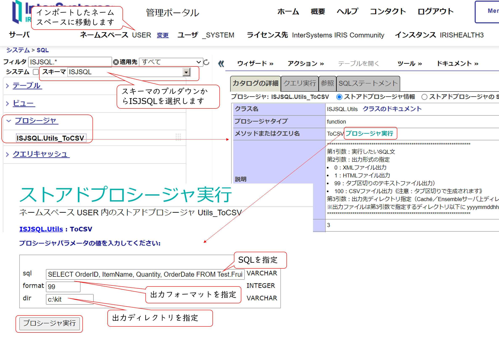

# 任意のSQL文の実行結果をプログラムでCSVファイルに出力するサンプル

## インポート方法
1) スタジオをご利用の方は、[ISJSQL.Utils.xml](./ISJSQL.Utils.xml) をスタジオ・管理ポータルから利用されたいネームスペースにインポートしてください。

2) VSCodeをご利用の方は、IRISに接続後、[Utils.cls](./src/ISJSQL/Utils.cls) を保存してご利用ください。

## 実行方法

1) ターミナルで実行する方法

    インポートしたネームスペースに移動し、以下実行します。

    ```
    // 実行したいSQLを変数に設定
    set sql="SELECT OrderID, ItemName, Quantity, OrderDate FROM Test.FruitsOrder"
    
    // インポートしたクラスメソッドを実行します。1が返れば成功です
    write ##class(ISJSQL.Utils).ToCSV(sql,,"c:\kit")
    ```

    メソッドの引数詳細は、[クラスメソッドの説明文（Utils.cls 4～12行目）](./src/ISJSQL/Utils.cls#L4) をご参照ください。

    出力結果は、第3引数に指定したディレクトリ以下に　yyyymmddhhmmss.拡張子　の形式で出力されます（拡張子は、メソッドの第2引数で指定する形式により異なります）。


2) 管理ポータルからストアドプロシージャとして実行する方法

    管理ポータル > システムエクスプローラー > SQL > インポートしたネームスペース移動後、ISJSQL.Utils_ToCSV()を実行します。



    出力結果は、第3引数に指定したディレクトリ以下に　yyyymmddhhmmss.拡張子　の形式で出力されます（拡張子は、メソッドの第2引数で指定する形式により異なります）。
